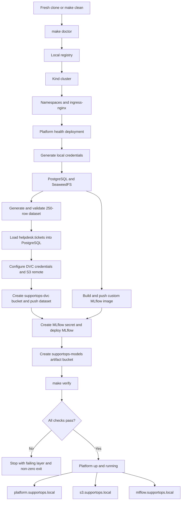
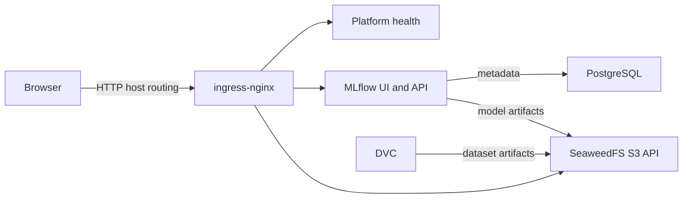

# AI Platform Engineering Platform

This repository contains a platform engineering reference setup for local Kubernetes development and platform health checks.

## Repository Layout

- `platform/`
  - `versions.env` - version definitions for platform components
  - `foundation/` - platform bootstrap manifests and values
  - `kind/` - kind cluster profiles and local cluster configuration
  - `data/` - platform data-layer manifests, including PostgreSQL manifests
- `starter-project/`
  - `platform-health/` - simple health probe app used for platform validation
    - `Dockerfile`
    - `www/` - static health endpoints (`healthz`, `readyz`, `index.html`)
- `doc/` - lab and deployment documentation
- `docs/` - previous lab documentation
- `evidence/` - captured lab outputs and platform validation evidence

## Getting Started

1. Install Docker, Kind, kubectl, Helm, Python 3, and curl.
2. On Windows, run PowerShell as Administrator and execute:

   ```powershell
   powershell.exe -ExecutionPolicy Bypass -File .\scripts\configure-windows-hosts.ps1
   ```

3. Build the complete platform from the repository root:

   ```bash
   make doctor
   make up
   ```

4. Confirm every platform layer independently:

   ```bash
   make verify
   make status
   ```

5. Open the local services:

   - Platform health: <http://platform.supportops.local>
   - S3 API: <http://s3.supportops.local>
   - MLflow: <http://mlflow.supportops.local>

To prove clean rebuild reproducibility, run `make reset`. This removes the Kind
cluster and local registry resources, rebuilds the platform, and runs the full
verification gate through the `up` target.

## Platform lifecycle



The running data flow is:



## Progress update

The current branch now includes the following lab progress:

- A PostgreSQL data-layer deployment manifest under `platform/data/postgresql.yaml`.
- A SeaweedFS data-layer deployment manifest under `platform/data/seaweedfs.yaml`.
- A reproducible dataset workflow via the `Makefile` targets `dataset`, `database`, and `dvc`.
- A generated SupportOps sample dataset and validation workflow under `datasets/`.
- Verified PostgreSQL import and row-count checks for the loaded ticket data.
- An MLflow deployment under `platform/mlflow/mlflow.yaml` for model lifecycle management.
- Local ingress access for MLflow via `http://mlflow.supportops.local`.

## Notes

- Keep local environment files out of source control by using `.gitignore`.
- Use the `evidence/` folder to store output from verification commands and lab checks.
